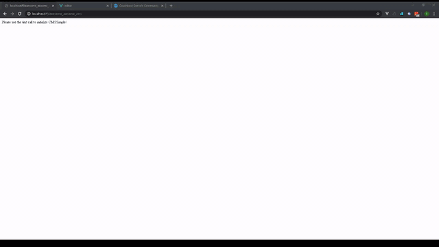

# cmssimple

cmssimple is a fully dockerized cms for text based sites, using couchbase as a database, expressjs as a rest api and vue.js for the editor, offering simplicity and speed both during deployment and during usage.

In order to run the application, you can either use the example docker-compose file, or set the variables manually.

CMS variables:

      COUCHBASE_USERNAME: the username used when setting up couchbase
      COUCHBASE_PASSWORD: the password used when setting up couchbase
      COUCHBASE_HOST: the location of the couchbase cluster, incl. port
      HOST: the location of the site
      NAME: the name of the site
      ADMIN_PASSWORD: the password for making changes using the editor
      DEFAULT_BUCKET: the bucket for storing the main part of cmssimple
      PAGES_BUCKET: the bucket for storing pages

EDITOR variables:

      HOST: the location of the site

When starting for the first time, the editor needs to be fired up and init the system from the appropriate tab,
then the editor can be used to add a logo and a color scheme, and then the user can start adding and sorting pages at will, using the text editor.

NOTES during deployment.

The ports are hardcoded in the dockerfiles, to be 80 for the cms and 2000 for the editor, if there is a requirement for change, the dockerfiles need to be changed accordingly and the images rebuilt.

You may need to set up a docker network or use the external IP in order to reach the couchbase cluster and you also need to create the buckets

libraries used:

    editor:
        https://github.com/v-comp/v-color
        https://github.com/vuejs/vue
        https://github.com/egoist/vue-slim-tabs
        https://github.com/davidroyer/vue2-editor
        https://github.com/SortableJS/Vue.Draggable

    cms:
        https://github.com/expressjs/cors
        https://github.com/expressjs/express
        https://github.com/couchbase/couchnode
        https://github.com/reworkcss/css
        https://github.com/Jxck/html2json

